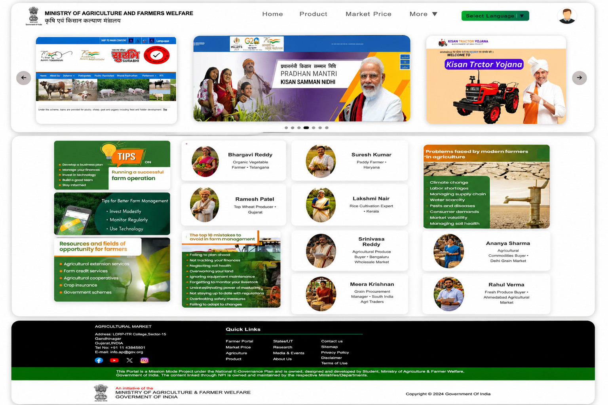
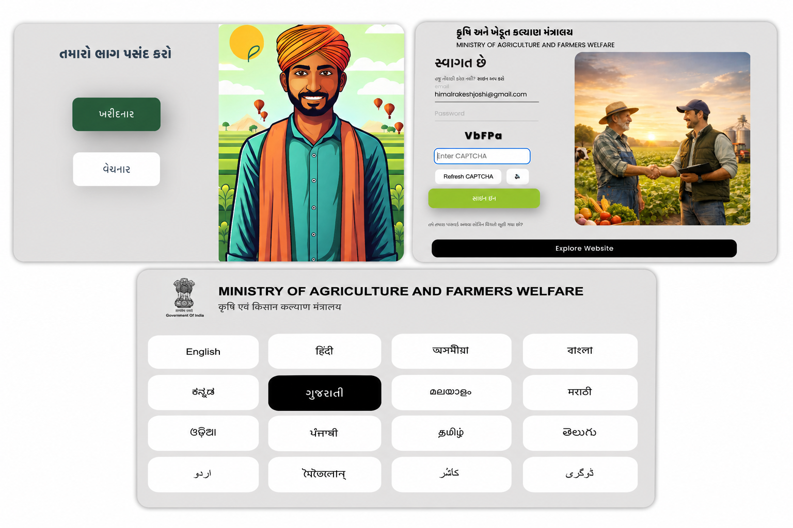
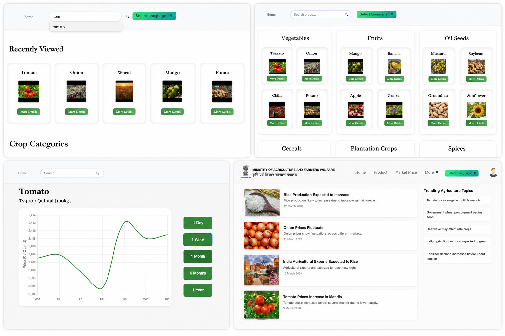
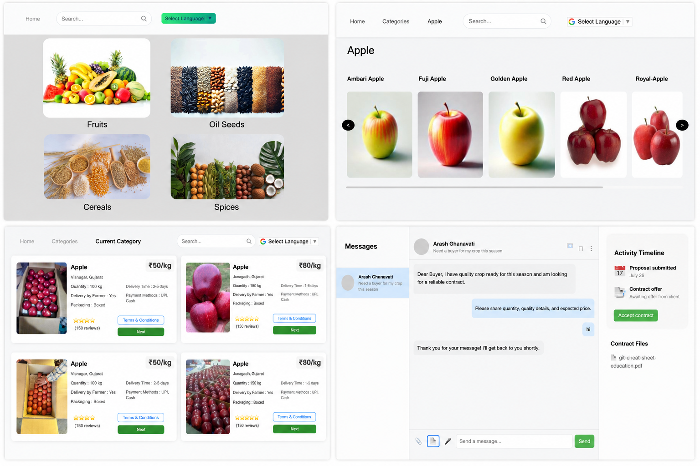

# Assured Contract Farming Platform  
### Transforming Agriculture Through Technology

---

## Project Overview

This project addresses key challenges faced by Indian farmers by building a **technology-driven platform for assured contract farming and stable market access**.

The platform works like an **agriculture-focused digital marketplace**, enabling farmers to:
- Connect directly with buyers  
- Create secure and transparent contracts  
- Access real-time market insights  
- Receive timely and fair payments  

The goal is to improve income stability, reduce exploitation, and promote sustainable agricultural practices.

---

## Problem Statement

Indian farmers face multiple structural challenges:

### Key Challenges

- 📉 Market Access Uncertainty  
- ⚠️ Exploitation Risks in traditional markets  
- ⏳ Payment Delays  
- 📚 Lack of Awareness  
- 🤝 Small Farmer Vulnerability  

---

## Objective

To build a **secure and transparent digital platform** that:
- Connects farmers with buyers  
- Enables contract-based agreements  
- Ensures stable and predictable income  

---

## Proposed Solution

A **digital marketplace ecosystem** that provides:
- Transparent pricing  
- Verified users  
- Secure contracts  
- Reliable communication  

---

## Platform Flow

Language Selection → Role Selection → Login → Home Dashboard

After login:

Home  
├── Product Listing  
├── Market Price  
├── News  
└── Profile   

---

## Preview

### Home Page


---

### Language, Role & Login Flow


---

### Market Price & News Section


---

### Product Listing & Communication


---

## Screens Covered

- 🌐 Language Selection  
- 👤 Role Selection  
- 🔐 Login System  
- 🏠 Home Dashboard  
- 🛒 Product Marketplace  
- 📊 Market Price Analysis  
- 📰 News Section  
- 💬 Messaging System  
- 👤 Profile  

---

## Key Features

### Assured Contract Farming
- Digital agreements  
- Defined pricing & quantity  
- Reduced uncertainty  

### Transparent Marketplace
- Real-time pricing  
- Verified buyers  
- Fair trade system  

### Secure Payment System
- Escrow-based payments  
- Multiple payment methods  
- Timely transactions  

### Farmer Education
- Informational content  
- Awareness tools  
- Decision support  

### Support for Small Farmers
- Group selling  
- Cooperative tools  
- Increased bargaining power  

### Government Integration

- DigiLocker  
- eNAM  
- Contract Farming Act  
- Agri-Stack  
- Digital Agriculture Mission  

---

## Project Structure

```bash
MAIN/
│
├── Language page/
├── Choose role page/
├── Log in page/
├── Home page/
├── Product page/
├── Market Price Page/
├── News page/
├── Profile page/
├── Selection of market price product/
│
└── README.md

---

## Expected Impact

- Improved farmer income stability  
- Reduced exploitation  
- Transparent agricultural ecosystem  
- Stronger rural economy  
- Support for small farmers  

---

## Technologies Used

- HTML  
- CSS  
- JavaScript  

---

## Conclusion

This project builds a **fair, transparent, and technology-driven agricultural marketplace** that strengthens the connection between farmers and buyers.

---

## Author

**Himal Joshi**
